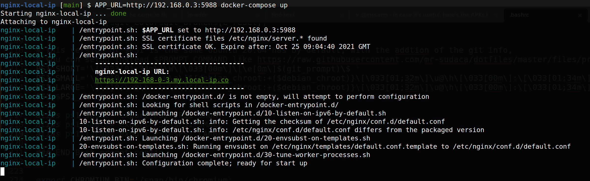

local-ip.medicmobile.org HTTPS reverse-proxy
===============================

> 🚀 Public URLs to expose your local webapp without
>    external proxies in your LAN

Set of Nginx and Docker configurations to launch a Nginx reverse proxy using a public SSL certificate for
domains `*.local-ip.medicmobile.org`. The SSL certificate is signed by a CA authority
and provided for free by [local-ip.medicmobile.org](https://local-ip.medicmobile.org/). Moreover,
they have a free DNS service that provides wildcard DNS for any IP
address, including private IPs:

    $ dig 10-0-0-1.local-ip.medicmobile.org +short
    10.0.0.1

So, having a public certificate and a public DNS that resolves to your
local IP address, you can launch the HTTPS server to proxy
your local app built with whatever stack, and connect any browser,
app or device that requires to access it with HTTPS like Android
apps that sometimes don't work without a secure connection.


Run
---

If you have a webapp running locally on port `5988`, and your local IP is `192.168.0.3`, you would normally access the app at `http://192.168.0.3:5988` (either from the same device or any other device within the same network). 

To run nginx-local-ip in front of your webapp, simply launch the Docker container with the following command:

```shell
docker run --rm \
    -e APP_URL=http://192.168.0.3:5988 \
    -p 443:443 \
    medicmobile/nginx-local-ip
```

Now you should be able to access your app at `https://192-168-0-3.local-ip.medicmobile.org`! When you are done, simple cancel the command or close the terminal and the nginx-local-ip container will be automatically removed.

(See the included [Compose file](./compose.yaml) for examples of more advanced configuration options.)

Note that the IP set in the `APP_URL` environment variable is passed
as it is in your computer, but the URL to access the app in the devices
separates each number from the IP address by `-`
(isn't `.`): https://192-168-0-3.local-ip.medicmobile.org .

Anyway, you will see the final URL logged in the console when the
container is launched:



Also note that you cannot use the localhost IP 127.0.0.1, it needs to
be the IP of your WiFi connection, Ethernet connection, or whatever
connection your computer has with the network is connected to. You
can get your IP address in a Unix system with `ifconfig` or `ip addr`.
Your computer may also have other virtual interfaces with IP addresses
assigned, omit them, like the IP of the _docker0_ interface.

> :signal_strength: **Tip**: if your IP is defined dynamically, try with `ip addr show dynamic`.

You can also map port `80` (e.g. `-p 80:80`) so if you forget to write the URL
with https:// , Nginx redirects the request to the HTTPS version
for you 😉.

#### Firewall

The HTTP/HTTPS ports (`80`/`443`) need to accept traffic from the IP address of your host machine and your local webapp port (e.g. `5988`) needs to accept traffic from the IP address of the `nginx-local-ip` container (on the Docker network). If you are using the UFW firewall (in a Linux environment) you can allow traffic on these ports with the following commands:

> Since local IP addresses can change over time, ranges are used in these rules so that the firewall configuration does not have to be updated each time a new address is assigned.

```.sh
$ sudo ufw allow proto tcp from 192.168.0.0/16 to any port 80,443
$ sudo ufw allow proto tcp from  172.16.0.0/16 to any port 5988
```

When using this Firewall configuration, you need to ensure the IP address for your nginx-local-ip container is assigned from the `172.16.0.0/16` subnet. See the `networks` configuration in the [Compose file](./compose.yaml) for an example of how to do this.

### Public SSL certificate

The certs are downloaded and cached from [local-ip.medicmobile.org](https://local-ip.medicmobile.org/) on first run. On subsequent runs, the `entrypoint.sh` script checks locally whether they are expired and downloads renewed certs from  [local-ip.medicmobile.org](https://local-ip.medicmobile.org/) if needed.

Development
-----------

If you want to make changes to the nginx-local-ip configuration, you can build the image locally.

Start by cloning this repository:

    $ git clone https://github.com/medic/nginx-local-ip.git

Then you can run your local configuration with:

    $ cd nginx-local-ip/
    $ APP_URL=http://192.168.0.3:5988 docker compose up

#### Docker note
A local image is created the first time the command executed, and there is no need to rebuild it if you change the Nginx configuration. If you want to just edit the `default.conf.template` file or change the ports mapped, simply recreate the containers to pick up the changes.

If you do need to rebuild the container, append `--build` on to your compose call: ` docker compose up --build`.

Requirements
------------

Only **Docker** and **Docker compose** installed are needed, and despite
this setup helps you to connect your devices with your webapp using
a local connection (without complex reverse proxy connections through
Internet like _Ngrok.com_), the devices that want to connect with the app
still need access to Internet just to resolve the `*.local-ip.medicmobile.org` domain
against the `local-ip.medicmobile.org` public DNS, unless you configure your own DNS server
within your network, which needs to be configured in all the devices were you
are going to use the app. In that case, no Internet connection will be required,
just a LAN connection.


Certificate & DNSs providers
---------

By default, this service works with `local-ip.medibmobile.org` (which in turn uses [localtls](https://github.com/Corollarium/localtls/)), but it can be configured to work with any provider that offers:
* publicly downloadable TLS certificates via `curl`
* DNS resolution based off IP-in-URL

For example, if you wanted to use `local-ip.co` (though use [with caution](https://github.com/medic/cht-core/issues/8100)), you would set these four environment variables for you Docker Compose call:

* `CERT_PEM_SRC` set to to `http://local-ip.co/cert/server.pem`
* `CERT_CHAIN_SRC` set to `http://local-ip.co/cert/chain.pem`
* `CERT_KEY_SRC`  set to `http://local-ip.co/cert/server.key`
* `DOMAIN` set to `my.local-ip.co`

Using inline variables, this would look like:

```shell
CERT_PEM_SRC=http://local-ip.co/cert/server.pem \
CERT_CHAIN_SRC=http://local-ip.co/cert/chain.pem \
CERT_KEY_SRC=http://local-ip.co/cert/server.key \
DOMAIN=my.local-ip.co \
docker compose up 
```

Troubleshooting
---------

### Port Conflicts

If you run `docker compose` and you get a `address already in use` error like this:

```
ERROR: for nginx-local-ip_app_1  Cannot start service app: driver failed programming external connectivity on endpoint nginx-local-ip_app_1 (5a31171148dcaa58b4053f793288aaa940f5678043d302c1c1ad87
5cdae3a684): Error starting userland proxy: listen tcp4 0.0.0.0:443: bind: address already in use
```                                                                                          

You may need to change one or both ports. For example, you could shift them
up to 8xxx like so:

    $ HTTP=8080 HTTPS=8443 APP_URL=http://192.168.1.3:5988 docker compose up

Also, a convenient environment file can be used to store the new values as
suggested in the [Running with Medic-OS](#running-with-medic-os) section:

**my.env file:**

    HTTP=8080
    HTTPS=8443

Run with: `APP_URL=https://192.168.1.3:5988 docker compose --env-file=my.env up`

You would then access your dev instance with the `8443` port.
Using the sample URL from above, it would go from `https://192-168-0-3.local-ip.medicmobile.org`
to this instead `https://192-168-0-3.local-ip.medicmobile.org:8443`.


Copyright
---------

Copyright 2021 Medic Mobile, Inc. <hello@medic.org>.

The SSL certificate files are downloaded from Internet at runtime,
and are property of **local-ip.medicmobile.org**.


License
-------

The software is provided under AGPL-3.0. Contributions to this project
are accepted under the same license.
